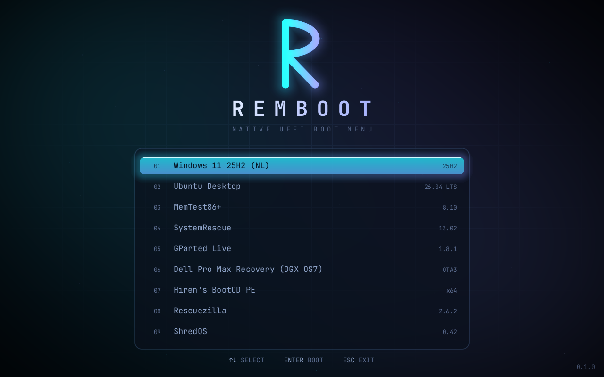
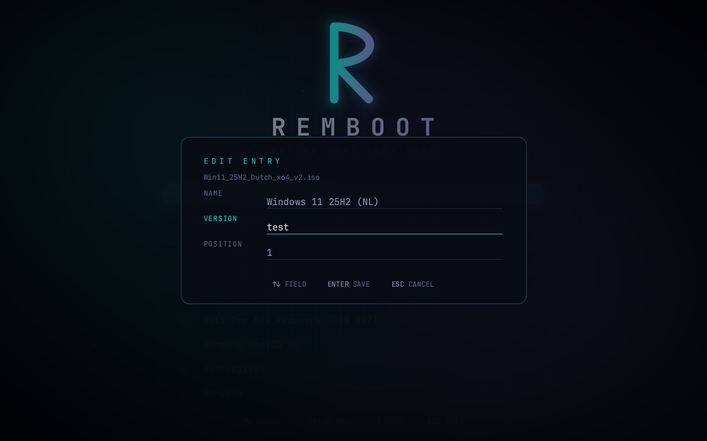
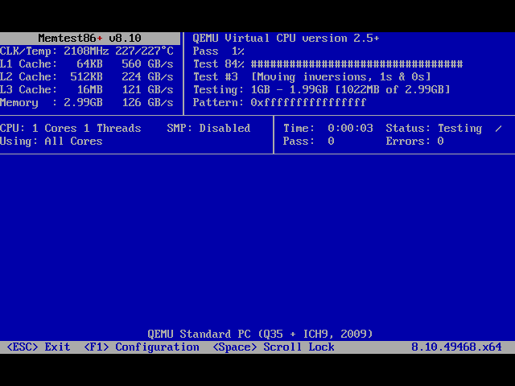
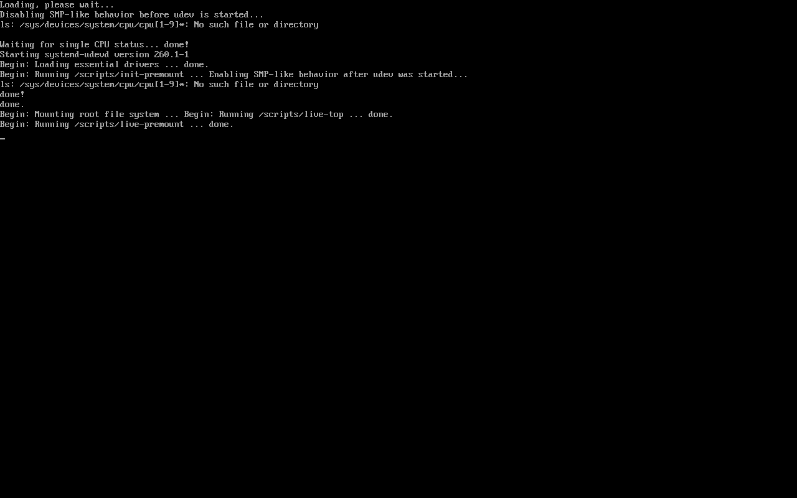
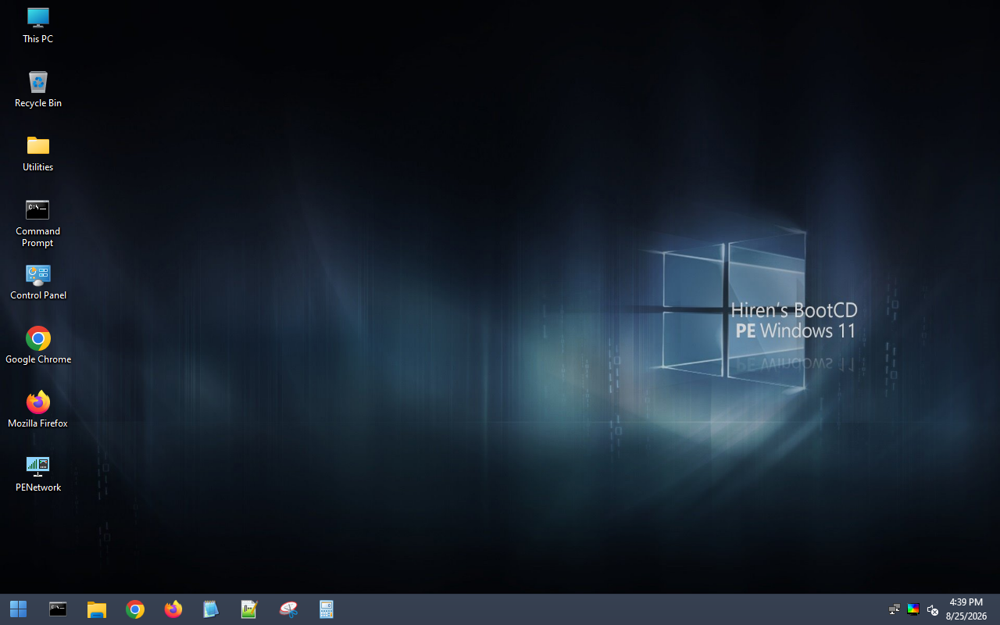

# RemBoot

A UEFI boot menu (`BOOTX64.EFI`) for a USB stick: put your `*.iso` files on it,
boot from it, pick one, it boots. Works with Linux live/installer ISOs, WinPE
(Hiren's, HBCD), and rescue tools. No bootloader install step; the stick just
needs the app plus your ISOs.



## Requirements

- A 64-bit UEFI machine. Boot the USB from the firmware boot menu (F12 / F9 / Esc).
- **Secure Boot**: off by default (the app is unsigned). It can be left *on*
  with a signed build + a one-time key enrolment — see [Secure Boot](#secure-boot).
- WinPE ISOs (Hiren's, HBCD) load `boot.wim` into a RAM disk; give the machine
  a few GB of free RAM or Windows Boot Manager stops with `0xc0000017`.

## Create the USB

The [Releases](../../releases) page has prebuilt downloads — `BOOTX64.EFI` and
the `remboot-usb` tool (`.exe` for Windows, `.deb` for Debian/Ubuntu, and a raw
Linux binary) — or build from source (see [Build from source](#build-from-source)).

### Simplest — one FAT32 partition (ISOs under 4 GB)

No script, no partitioning. Format the USB as **FAT32** in Explorer, then copy
onto it:

- `BOOTX64.EFI` into `\EFI\BOOT\`
- your `*.iso` files in the root
- optionally `remboot.conf`

That's it — RemBoot reads and boots ISOs straight off the FAT partition. The
only limit is FAT32's 4 GB max file size, so this works when every ISO is
under 4 GB.

### Larger ISOs — add an exFAT partition

Some images (Windows, Hiren's, Ubuntu) are 6–10 GB and don't fit on FAT32, so
put those on a second **exFAT** partition:

| # | Filesystem | Contents |
|---|------------|----------|
| 1 | FAT32 (~512 MB) | `\EFI\BOOT\BOOTX64.EFI` |
| 2 | exFAT (rest) | your `*.iso` files (+ optional `remboot.conf`) |

RemBoot can't rely on the firmware to read exFAT, so it includes its own
reader — you just create the two partitions once (below) and drop ISOs on the
exFAT one.

### Windows script (does the two-partition layout for you)

1. Build the app (produces `dist\EFI\BOOT\BOOTX64.EFI`):
   ```bash
   wsl -d Ubuntu -u root -- bash /mnt/c/GitHub/RemBoot/tools/build.sh
   ```
2. Find the USB's disk number in an **elevated** PowerShell:
   ```powershell
   Get-Disk
   ```
3. Provision it — **this erases the whole disk**:
   ```powershell
   .\tools\make-usb.ps1 -DiskNumber 2 -IsoSource "C:\path\to\your\isos"
   ```
   Omit `-IsoSource` to install only the app and copy ISOs later in Explorer.

### Cross-platform tool (Linux / macOS / Windows)

`remboot-usb` provisions a stick on any OS. Download it from
[Releases](../../releases) (`.exe`, `.deb`, or a Linux binary) or build it with
`cargo build -p remboot-usb`, then either use the graphical interface:

```bash
remboot-usb gui        # opens a local web page: pick the disk, click Create
```

or the command line:

```bash
remboot-usb list                       # find your USB's id
remboot-usb create --disk /dev/sdb --isos ~/isos     # ERASES the disk
```

`--simple` makes a single FAT32 stick (ISOs under 4 GB); otherwise it creates
the FAT32 + exFAT layout. Run it as Administrator / root so it can write to the
disk. On Linux it needs `gdisk`, `dosfstools` and `exfatprogs`; macOS uses
`diskutil`; Windows uses the built-in Storage cmdlets. The GUI is a small
self-contained web server built into the binary — no extra runtime.

### Manual (diskpart)

<details><summary>Without the script</summary>

Elevated `diskpart` (replace <code>disk N</code> with your USB — wrong number wipes the wrong drive):

```
list disk
select disk N
clean
convert gpt
create partition efi size=512
format fs=fat32 quick label=REMBOOT
assign letter=S
create partition primary
format fs=exfat quick label=REMBOOT_DATA
assign letter=D
exit
```

```powershell
mkdir S:\EFI\BOOT
copy dist\EFI\BOOT\BOOTX64.EFI S:\EFI\BOOT\BOOTX64.EFI
copy remboot.conf.example D:\remboot.conf   REM optional
REM copy your *.iso files to D:\
```
</details>

### Existing Ventoy stick

Same layout (exFAT data + small FAT boot partition). Back up
`VTOYEFI\EFI\BOOT\BOOTX64.EFI`, replace it with RemBoot's `BOOTX64.EFI`; your
existing ISOs are read directly.

## Managing ISOs

Add or remove ISOs by copying files to the exFAT partition — nothing else to do.

Entries are labelled by filename by default. An optional `remboot.conf` (on the
exFAT partition or the FAT boot partition) sets clean names, versions and order
— see [remboot.conf.example](remboot.conf.example):

```ini
ISO: memtest.iso
NAME: MemTest86+
VERSION: 8.10
POSITION: 3
```

Keys are case-insensitive; `#`/`;` are comments; only `ISO:` is required.
Entries with a `POSITION` come first (ascending), the rest sort alphabetically.
The filename is always what boots, so labels never affect booting.

To edit without touching the file: press **E** on an entry, change
name/version/position, **ENTER** saves (to the boot partition), ESC cancels,
`↑↓` switches fields.



## Secure Boot

RemBoot can run with Secure Boot **on**, using the standard signed-shim + MOK
chain (the same mechanism Linux distros and Ventoy use). Build the signed
layout in WSL:

```bash
wsl -d Ubuntu -u root -- bash /mnt/c/GitHub/RemBoot/tools/secureboot.sh
```

This produces `/root/remboot-esp-sb.img` with a Microsoft-signed shim as
`BOOTX64.EFI`, MokManager, RemBoot signed with a key generated locally in
`dist/keys/` (kept private, gitignored), and `ENROLL_REMBOOT.cer` (the key to
enrol). Put those four files on the FAT boot partition instead of the plain
`BOOTX64.EFI`.

The first boot does a one-time key enrolment (shim can't trust RemBoot yet):

1. *Verification failed* → **OK**
2. *Press any key to perform MOK management* → press a key
3. **Enroll key from disk** → the `REMBOOT` volume → `EFI/BOOT/ENROLL_REMBOOT.cer`
4. **Continue** → **Yes** → **Reboot**

After that RemBoot boots with Secure Boot on. ISOs that ship a signed
bootloader (Windows, Ubuntu, Fedora, GParted, …) chainload fine under Secure
Boot; ISOs with an unsigned bootloader won't — turn Secure Boot off for those
(even Ventoy has this limit). Verified in QEMU with SB-enabled OVMF: RemBoot
boots after enrolment, and GParted Live chainloads to its GRUB menu.

## Build from source

Everything builds through WSL2 Ubuntu (as root): Rust stable + the
`x86_64-unknown-uefi` target, QEMU + OVMF for testing, `mtools`/`exfatprogs`
for the disk images.

```bash
# build the app + a bootable FAT ESP image + dist/ for the USB script
wsl -d Ubuntu -u root -- bash /mnt/c/GitHub/RemBoot/tools/build.sh

# unit tests (pure logic: exFAT, config, menu, easing)
wsl -d Ubuntu -u root -- bash /mnt/c/GitHub/RemBoot/tools/test.sh

# boot in QEMU (REMBOOT_MEM=8192 for heavy WinPE ISOs)
wsl -d Ubuntu -u root -- bash /mnt/c/GitHub/RemBoot/tools/run-qemu.sh scenarios/real.sh
```

Layout: `core/` is UEFI-free, host-testable logic (exFAT reader, `remboot.conf`
parser, menu state, rendering math); `efi/` is the UEFI binary (`main.rs`,
`vdisk.rs` = the virtual-CD that presents an ISO to the firmware and chainloads
it, `gfx.rs`).

## How it boots an ISO

RemBoot presents the chosen ISO to the firmware as a virtual CD served on
demand ([efi/src/vdisk.rs](efi/src/vdisk.rs)) — read straight from a FAT file,
or from the exFAT partition via its own reader
([core/src/exfat.rs](core/src/exfat.rs)) since firmware can't mount exFAT. The
firmware then mounts it (El Torito + FAT) and RemBoot chainloads the ISO's own
`\EFI\BOOT\BOOTX64.EFI`. Nothing is copied into RAM.

Tested end to end with memtest86+, gparted-live (GRUB → Linux) and Hiren's
BootCD PE (Windows):

| memtest86+ | gparted-live | Hiren's BootCD PE |
|---|---|---|
|  |  |  |

## License

GPL-3.0 (see [LICENSE](LICENSE)). Bundles JetBrains Mono under the SIL Open
Font License ([assets/fonts/OFL.txt](assets/fonts/OFL.txt)).
